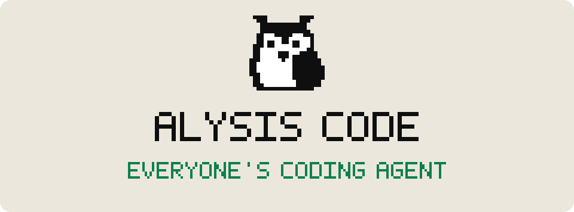

<p align="center">
  <picture>
    <source media="(prefers-color-scheme: dark)" srcset="docs/assets/banner-dark.svg">
    
  </picture>
</p>

<p align="center">
  Local CLI coding agent that turns plans into reviewed, PR-ready code.<br>
  Bring your own model. Sandboxed by default.
</p>

<p align="center">
  <a href="https://alysiscode.com/">Website</a> ·
  <a href="https://github.com/AlysisAi/alysis-code/tree/main/docs">Docs</a> ·
  <a href="https://github.com/AlysisAi/alysis-code/blob/main/docs/CHANGELOG.md">Changelog</a>
</p>

<p align="center">
  <a href="https://github.com/sponsors/AlysisAi"></a>
</p>

<p align="center">
  <a href="https://github.com/AlysisAi/alysis-code/actions/workflows/ci.yml"></a>
  <a href="https://pypi.org/project/alysis-code/"></a>
  <a href="https://pypi.org/project/alysis-code/"></a>
  <a href="https://github.com/AlysisAi/alysis-code/blob/main/LICENSE"></a>
</p>

---

## Get Started

Alysis Code requires **Python 3.11+** and runs on macOS, Linux, and Windows.

**1 — Install**

```bash
pipx install alysis-code
```

**2 — Launch in your project**

```bash
cd your-project
alysis-code
```

The first run opens a guided setup wizard: choose **Use an API key** or **Use an AI subscription**,
connect a provider, and pick your default model. Re-run it anytime with `alysis-code setup`.
(`alysis` works too, as a short alias.)

**3 — Start building**

```bash
alysis-code chat                            # interactive coding session
alysis-code run "Fix the failing tests"     # one-shot task
```

Bring your own key from any supported provider — or point Alysis Code at a local endpoint (Ollama,
LM Studio, vLLM) and run fully offline. The `/config` picker lists every preset. Full walkthrough:
[Quickstart guide](docs/quickstart.md).

---

## Why Alysis Code

- **Easy to use** — a full coding agent behind a clean, convenient terminal interface that anyone can
  pick up and play with in minutes: slash commands, interactive pickers, and live status built in.
- **Built for every developer** — from solo scripts to team servers and CI, the same agent fits every
  workflow.
- **[Forge Mode](https://alysiscode.com/docs/concepts/tasks)** — plan-driven execution for larger work:
  plan, dispatch parallel workers, verify each task, ship PR-ready code.
- **[Orchestrated subagents](https://alysiscode.com/docs/concepts/agents)** — isolated workers run in
  parallel, verification is pinned to their exact candidates, and changes apply only after host-side
  conflict checks.
- **Free built-in web search** — model-independent `web_search` that works with any provider, at no
  extra cost.
- **[Bring your own model](https://alysiscode.com/docs/config/models)** — OpenAI, Anthropic, DeepSeek,
  Qwen, Gemini, Mistral, Xiaomi MiMo, OpenRouter, xAI, and more — plus local endpoints (Ollama,
  LM Studio, vLLM) for fully offline use.
- **[Deeply extensible](https://alysiscode.com/docs/concepts/plugins)** — skills, custom tools, MCP
  servers, hooks, subagents, and plugins, bundled in one declarative manifest.
- **[Sandboxed by default](https://alysiscode.com/docs/safety/sandbox-modes)** — Docker or Bubblewrap
  isolation with an always-on denylist that refuses `rm -rf /`, `curl | sh`, and `sudo` — even in
  `fullaccess`.

## Modes & Personas

Two layers control what the agent may do — one enforces, one focuses.

**Execution modes** are the enforcement layer. Choose one per command with `--mode`, switch in chat
with `/mode`, or set a default with `alysis-code config set default_mode <mode>`:

| Mode | Behavior |
| --- | --- |
| `readonly` | Inspection only — no file writes, shell, MCP, or subagent delegation. |
| `review` | The safe default — previews and asks before every write and shell command. |
| `auto` | Applies routine edits with fewer prompts; dangerous operations stay blocked. |
| `fullaccess` | No mode-level prompts for trusted workspaces — the denylist and audit log stay active. |

**Personas** are working postures layered on top. Switch with `/persona`, or cycle with **Tab** in
the TUI:

| Persona | Posture |
| --- | --- |
| `code` | Implementation — the default, full coding workflow. |
| `architect` | Planning and design — may write markdown documents only. |
| `ask` | Read-only questions and codebase exploration. |
| `debug` | Reproduce the failure first, then fix minimally and rerun the reproduction. |

A persona is a convention, never a permission: it can keep or lower your execution mode, but can
never raise it. Define your own in `.alysis_personas/*.md`.
[Learn more](https://alysiscode.com/docs/concepts/personas)

## Project Links

- [Website](https://alysiscode.com/)
- [Documentation](https://alysiscode.com/docs) — also mirrored in [docs/](docs/README.md)
- [Changelog](docs/CHANGELOG.md)
- [Contributing](.github/CONTRIBUTING.md) — local setup and PR expectations
- [Security policy](.github/SECURITY.md) — report vulnerabilities privately, never through public issues

## License

Apache-2.0. You're free to use, modify, and distribute this code, including commercially, as long as
you keep the attribution and license notices. See [LICENSE](LICENSE) and [NOTICE](NOTICE).

## FAQ

<details>
<summary><b>Where did Alysis Code come from?</b></summary>

Alysis Code is not a fork. The agent runtime, Forge orchestration, subagent system, terminal
interface, and sandbox layer were designed and built from zero by the Alysis AI team.
</details>

<details>
<summary><b>Is Alysis Code really open source?</b></summary>

Yes. The entire CLI is Apache-2.0 licensed. Bring your own API key from any supported provider, or
run fully offline against a local endpoint — nothing in the agent requires a paid account.
</details>

More questions? See the [full FAQ](https://alysiscode.com/docs/faq).

---

**Join the community** — [X](https://x.com/alysiscode) | [GitHub Issues](../../issues)
