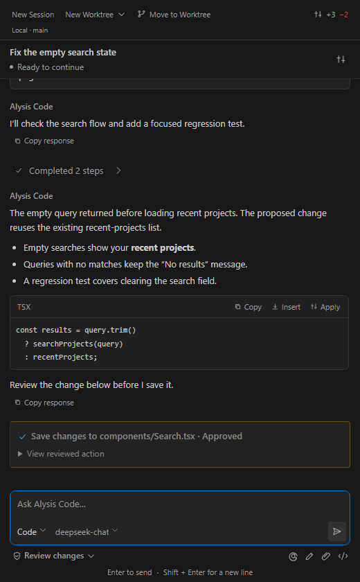
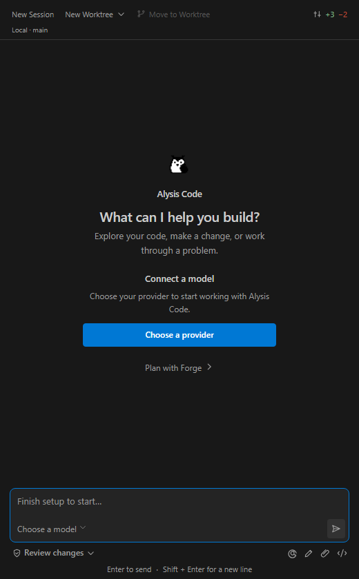
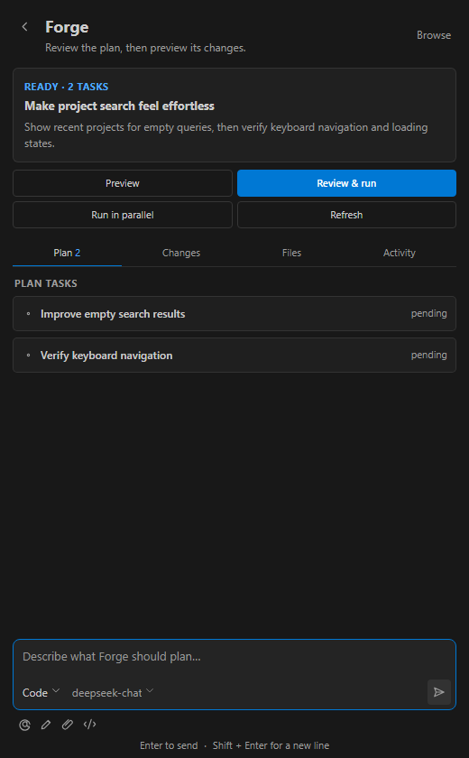
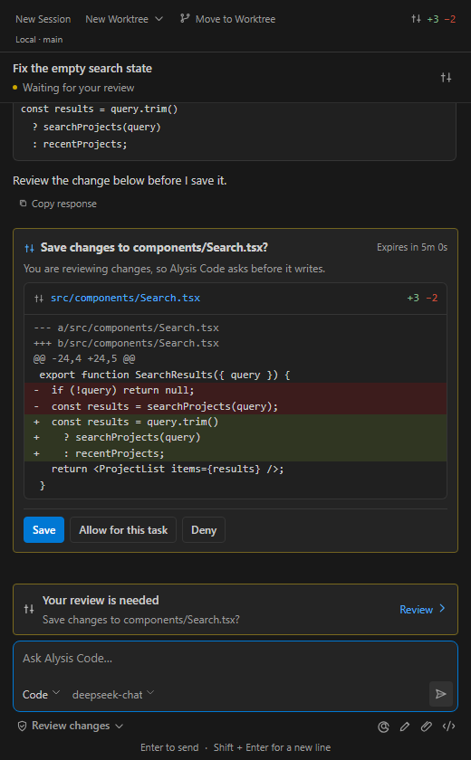
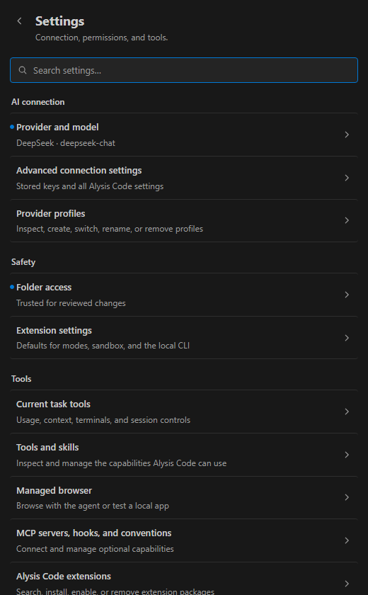

# Alysis Code for VS Code

Plan, edit, and review code in one VS Code conversation. Alysis Code connects to your model
provider, shows proposed changes, and keeps your provider key in VS Code SecretStorage.

Bring your own model. Review mode asks before important changes. You control commits.

*Interface screenshots use a disposable demo task and simulated provider data.*

## Why this one

- **Check your execution sandbox.** The Alysis Code runtime executes shell work under bubblewrap or
  Docker. Run **Alysis Code: Check Setup** before relying on commands or tests. It checks the
  selected sandbox policy, and the Sandbox chip in Runtime Details
  stays separate from CLI health, so a broken sandbox is visible rather than assumed.
- **Keys stored in SecretStorage.** Your API key is stored through VS Code SecretStorage,
  passed to the runtime only through the child process environment — never on a command line, never
  in settings. Diagnostic output is redacted. It is stripped from every non-credential child process (version,
  health, doctor probes), and forwarding is gated on executable origin: an `alysis` binary
  resolved from inside an untrusted workspace never receives it.
- **Native Tasks and Debug, not terminal scraping.** The agent asks the extension host to run your
  real `tasks.json` and `launch.json` entries over a typed protocol. Starts require fresh approval
  and Workspace Trust, results are bounded and redacted, and only the requesting session can
  observe or stop its own executions.

## Requirements

- VS Code 1.90 or later, on a local folder. Virtual workspaces are not supported.
- A model provider API key, or a local endpoint (Ollama, LM Studio, vLLM).
- Git is required for file checkpoints and worktrees.
- Release packages include the Alysis Code runtime for Windows, macOS, and Linux, on x64 and
  ARM64. No Python or separate CLI installation is required. The extension verifies the runtime,
  installs it outside your workspace, and health-checks it before use.
- Sandboxed shell execution requires a supported bubblewrap or Docker installation. The bundled
  runtime does not install an OS sandbox; **Check Setup** reports availability on your machine.
  Native VS Code Tasks and Debug configurations execute through VS Code with separate approvals.

## Install

1. Install the extension, open the Alysis Code icon in the Activity Bar, and run
   **Alysis Code: Check Setup** to validate the runtime, protocol, and sandbox.
2. Run **Alysis Code: Configure Provider** to store your API key, then describe a task in the
   composer. **Alysis Code: Open Setup Guide** walks the same path if you prefer the walkthrough.

## Features

- **One conversation, in the sidebar.** **Alysis Code: Open Alysis Code** opens a single chat surface
  with streamed replies, collapsible tool calls, approvals, diffs, and diagnostics in the same
  place. Slash commands are routed by the extension to typed handlers, not sent to the model as
  text; unknown commands fail closed with help.
- **Plan before you change anything.** **Alysis Code: Create a Plan** produces a structured plan with
  file scope, acceptance criteria, verification commands, and dependencies, plus a readiness panel
  that names write scope, required approvals, and gates before you run it.
- **Review-mode execution that never commits.** **Alysis Code: Review and Run Plan** runs a
  non-mutating preview first, then executes selected tasks only after explicit confirmation.
  Changes land in your working tree and are reviewed file by file in the native VS Code diff
  editor; committing and reverting stay in the Source Control panel where you control them.
- **Parallel work, reviewed per task.** **Alysis Code: Run Plan in Parallel** dispatches plan tasks
  across workers with disjoint write scopes and a task-attributed approvals inbox, then presents
  each task's diff for Keep or Discard. Nothing merges on its own.
- **Approvals you actually see.** Workers run without auto-approval. Dangerous actions pause and
  wait; "allow for session" appears only when the backend scopes it to an exact command or file
  set, and a timed-out approval is denied, not granted.
- **Personas that only narrow, never widen.** A picker beside the model chip (or `/persona`)
  switches between the CLI's code, architect, ask, and debug personas plus your custom ones — each
  row shows the mode it would land on, because a persona can narrow what the agent may do, never
  widen it.
- **Managed browser and native chat.** **Alysis Code: Open Managed Browser** gives the agent a
  public-web-only browser with bounded snapshots and diagnostics, and an `@alysis` participant
  in VS Code's native chat routes `/help`, `/forge`, `/execute`, and `/doctor` into the same
  controllers.

## Providers

Bring your own key. The Alysis Code runtime ships 32 provider presets, including OpenAI, OpenAI
Responses, Anthropic Claude, Google Gemini, DeepSeek, Alibaba Qwen / DashScope (Intl, US, China),
Zhipu / GLM, Xiaomi MiMo, Kimi and Kimi Code, MiniMax, ByteDance Doubao, Groq, Cerebras,
Mistral AI, xAI Grok, Cohere, OpenRouter, Perplexity Agent API, Together AI, and Fireworks AI.

Running local or self-hosted is a first-class preset: **Ollama**, **LM Studio**, and **vLLM**. Any
other OpenAI-compatible endpoint works through the Custom preset and `alysis.baseUrl`.

Pick one with **Alysis Code: Configure Provider** or **Alysis Code: Models and Providers**.

## Settings

| Setting | What it does |
| --- | --- |
| `alysis.defaultMode` | Choose how much independence Alysis Code has when starting a task: `readonly` (inspect and explain only), `review` (default; ask before important changes), `auto` (work independently within Alysis Code safeguards). |
| `alysis.defaultModel` | Optional default model name passed to the Alysis Code IDE bridge. |
| `alysis.baseUrl` | Optional OpenAI-compatible provider base URL. Credentials must be stored in SecretStorage, not this setting. |
| `alysis.sandboxProfile` | Extension-side label for the intended Alysis Code sandbox profile (`default`, `strict`, `warn`, `off`). Runtime policy remains owned by the CLI. |
| `alysis.enableForge` | Show Alysis Code Forge commands and views. Trusted-workspace gates still apply. |
| `alysis.forgeExecuteMaxSteps` | Optional positive `max_steps` override for plan execution. Leave 0 to use the CLI config default. |
| `alysis.forgeExecuteNoLog` | Pass `no_log=true` for plan execution jobs. Structured events and bounded artifacts remain available. |
| `alysis.showStatusBar` | Show the Alysis Code status bar item. |
| `alysis.autoStartBridge` | Automatically check bridge health after activation. Off by default. |
| `alysis.cliPath` | Development-only override for the `alysis` executable. Leave empty to use the signed, extension-managed runtime. |

Do not put API keys in settings. Use **Alysis Code: Configure Provider**. In an untrusted workspace,
workspace-scoped values for execution-sensitive settings are ignored.

## Privacy

Prompts, attached code, and tool results needed for a task are sent to your selected model endpoint.
Credentials are forwarded to the verified runtime in its process environment and used to authenticate
those requests. The provider's privacy and retention terms apply. A local model keeps inference on
that endpoint; web, browser, and other network tools can still contact external services.
Conversation history and runtime data are stored locally. Avoid including secrets in prompts.

## Known limitations

Stated plainly, because you will hit them.

- **Forge execution is review-mode only.** Selected-task execution is Workspace-Trust gated and
  approval-gated. Broad Forge `auto` and `fullaccess` execution are not available in the IDE.
- **Parallel runs never merge.** Each task's diff is presented for Keep or Discard; there is no
  auto-merge and no write to the base worktree.
- **Cancellation is cooperative.** A cancel request is honored at the backend's next checkpoint.
  There is no hard interrupt, and a job is never shown as cancelled until the backend confirms it.
- **MCP OAuth is local-window only.** It is unavailable on every remote extension host — SSH,
  containers, WSL, and tunnels — because the loopback callback would run on the remote while the
  browser opens locally.
- **The agent browser is public-web only.** Local testing against loopback is a separate,
  direct-user action behind a modal confirmation and is hidden from the agent. LAN and link-local
  destinations are denied on both paths.
- **No arbitrary terminals.** Alysis Code can list, show, and stop existing managed background
  terminals, but it cannot start an arbitrary shell or stream an interactive terminal session.

## Links

- Issues and feature requests: <https://github.com/AlysisAi/alysis-code/issues>
- Support and troubleshooting:
  [SUPPORT.md](https://github.com/AlysisAi/alysis-code/blob/main/extensions/vscode-alysis/SUPPORT.md)
- Security policy and vulnerability reporting:
  [SECURITY.md](https://github.com/AlysisAi/alysis-code/blob/main/.github/SECURITY.md) — report privately,
  never in a public issue.
- Contributing: [CONTRIBUTING.md](https://github.com/AlysisAi/alysis-code/blob/main/.github/CONTRIBUTING.md).
  Engineering documentation for this extension — architecture, security model, the full slash
  command reference, verification and dogfood procedures, release policy, and the detailed limits
  list — lives in
  [`docs/`](https://github.com/AlysisAi/alysis-code/tree/main/extensions/vscode-alysis/docs).
- License:
  [Apache-2.0](https://github.com/AlysisAi/alysis-code/blob/main/extensions/vscode-alysis/LICENSE.txt)
